<!--
  ═══════════════════════════════════════════════════════════════
   TEMA: GitHub'in koyu temasinda SIYAH + KIRMIZI,
         acik temasinda BEYAZ + YESIL palet gosterilir.
   Mekanizma: <picture> + (prefers-color-scheme) — her gorselin
   -dark ve -light varyanti assets/ altinda durur.
  ═══════════════════════════════════════════════════════════════
-->

<!-- ═══════════════════════ HERO ═══════════════════════ -->
<div align="center">

<picture>
  <source media="(prefers-color-scheme: dark)" srcset="assets/hero-dark.svg"/>
  <source media="(prefers-color-scheme: light)" srcset="assets/hero-light.svg"/>
  
</picture>

<picture>
  <source media="(prefers-color-scheme: dark)" srcset="https://readme-typing-svg.demolab.com?font=JetBrains+Mono&weight=600&size=24&duration=2600&pause=700&color=FF2E45&center=true&vCenter=true&width=900&height=64&lines=Full-Stack+Developer+%7C+Istanbul%2C+TR;React+%C2%B7+Next.js+%C2%B7+Node.js+%C2%B7+.NET;Flutter+ile+mobil%2C+Python+ile+yapay+zeka;Temiz+kod%2C+%C3%B6l%C3%A7eklenebilir+mimari;Her+commit+bir+y%C3%B6n%2C+her+bug+bir+fikir"/>
  
</picture>

<a href="https://linkedin.com/in/omerfarukoft"></a>
<a href="mailto:oturkdogdu1@gmail.com"></a>
<a href="https://instagram.com/omerfaruk.oft"></a>
<a href="https://github.com/OFThub?tab=repositories"></a>

<picture>
  <source media="(prefers-color-scheme: dark)" srcset="https://komarev.com/ghpvc/?username=OFThub&label=PROFILE+VIEWS&color=FF2E45&style=for-the-badge"/>
  
</picture>
<picture>
  <source media="(prefers-color-scheme: dark)" srcset="https://img.shields.io/badge/OPEN%20TO%20WORK-FF2E45?style=for-the-badge&logoColor=white"/>
  
</picture>

</div>

<!-- ═══════════════════════ TERMİNAL ═══════════════════════ -->
<div align="center">

<picture>
  <source media="(prefers-color-scheme: dark)" srcset="assets/terminal-dark.svg"/>
  <source media="(prefers-color-scheme: light)" srcset="assets/terminal-light.svg"/>
  
</picture>

</div>

<br/>

<!-- ═══════════════════════ HAKKIMDA ═══════════════════════ -->
##  Hakkımda


```txt
Öğrenmek sonu olmayan bir okyanus;
biz mühendisler bu okyanusta pusulayla ilerleriz.
Her commit bir yön, her bug bir fikir —
kaostan yapıya, düzenli adımlarla kod inşa ederiz.
```

- 🔭 Şu an **MangaStudio-Pro** (AI destekli çizim/manga üretim aracı) ve **PlannerAgent** (LLM tabanlı planlama ajanı) üzerinde çalışıyorum
- 🌱 **LLM ajanları, system design ve clean architecture** öğreniyorum
- 🧩 30+ public repo: web, mobil, yapay zekâ, CBS ve sistem programlama
- 👯 **Yapay zekâ ürünleri, full-stack SaaS ve açık kaynak** projelerde iş birliğine açığım
- 💬 Bana **React/Next.js, Node.js, .NET, Flutter, Python ve AI entegrasyonları** hakkında soru sorabilirsin
- ⚡ Eğlenceli gerçek: kod yazarken kahve tüketimim gözle görülür şekilde artar ☕

<br clear="right"/>

---

<!-- ═══════════════════════ YETENEKLER ═══════════════════════ -->
##  Yetenek Matrisi

<div align="center">

<picture>
  <source media="(prefers-color-scheme: dark)" srcset="assets/skills-dark.svg"/>
  <source media="(prefers-color-scheme: light)" srcset="assets/skills-light.svg"/>
  
</picture>

</div>

<details open>
<summary><b>🧰 Tüm Teknoloji Yığını</b> — <i>daraltmak için tıkla</i></summary>

<div align="center">

**Diller**

           

**Frontend & Mobil**

           

**Backend**

       

**Veritabanı & Cloud**

         

**DevOps & Araçlar**

            

**AI / Data**

      

**Tasarım**

    

</div>

</details>

<div align="center">

</div>

---

<!-- ═══════════════════════ PROJELER ═══════════════════════ -->
##  Öne Çıkan Projeler

<div align="center">

<a href="https://github.com/OFThub/MangaStudio-Pro"><picture>
  <source media="(prefers-color-scheme: dark)" srcset="https://github-readme-stats.vercel.app/api/pin/?username=OFThub&repo=MangaStudio-Pro&bg_color=0D1117&title_color=FF2E45&icon_color=FF6B7A&text_color=C9D1D9&border_color=3A1620"/>
  
</picture></a>
<a href="https://github.com/OFThub/PlannerAgent"><picture>
  <source media="(prefers-color-scheme: dark)" srcset="https://github-readme-stats.vercel.app/api/pin/?username=OFThub&repo=PlannerAgent&bg_color=0D1117&title_color=FF2E45&icon_color=FF6B7A&text_color=C9D1D9&border_color=3A1620"/>
  
</picture></a>

<a href="https://github.com/OFThub/ArnavutkoyCBS"><picture>
  <source media="(prefers-color-scheme: dark)" srcset="https://github-readme-stats.vercel.app/api/pin/?username=OFThub&repo=ArnavutkoyCBS&bg_color=0D1117&title_color=FF2E45&icon_color=FF6B7A&text_color=C9D1D9&border_color=3A1620"/>
  
</picture></a>
<a href="https://github.com/OFThub/StockPredictions"><picture>
  <source media="(prefers-color-scheme: dark)" srcset="https://github-readme-stats.vercel.app/api/pin/?username=OFThub&repo=StockPredictions&bg_color=0D1117&title_color=FF2E45&icon_color=FF6B7A&text_color=C9D1D9&border_color=3A1620"/>
  
</picture></a>

<a href="https://github.com/OFThub/AIContentPlatform"><picture>
  <source media="(prefers-color-scheme: dark)" srcset="https://github-readme-stats.vercel.app/api/pin/?username=OFThub&repo=AIContentPlatform&bg_color=0D1117&title_color=FF2E45&icon_color=FF6B7A&text_color=C9D1D9&border_color=3A1620"/>
  
</picture></a>
<a href="https://github.com/OFThub/Sportify"><picture>
  <source media="(prefers-color-scheme: dark)" srcset="https://github-readme-stats.vercel.app/api/pin/?username=OFThub&repo=Sportify&bg_color=0D1117&title_color=FF2E45&icon_color=FF6B7A&text_color=C9D1D9&border_color=3A1620"/>
  
</picture></a>

</div>

<details>
<summary><b>📚 Tüm Projeler (30+)</b> — <i>kategorilere göre</i></summary>

<br/>

**🤖 Yapay Zekâ & Veri**
[MangaStudio-Pro](https://github.com/OFThub/MangaStudio-Pro) · [MangaStudio](https://github.com/OFThub/MangaStudio) · [Manga-Pose-Transfer](https://github.com/OFThub/Manga-Pose-Transfer) · [PlannerAgent](https://github.com/OFThub/PlannerAgent) · [OftAi](https://github.com/OFThub/OftAi) · [AIContentPlatform](https://github.com/OFThub/AIContentPlatform) · [AIDocumentSimplifier](https://github.com/OFThub/AIDocumentSimplifier) · [StockPredictions](https://github.com/OFThub/StockPredictions) · [AI-Applications](https://github.com/OFThub/AI-Applications) · [AI](https://github.com/OFThub/AI) · [SEYREK](https://github.com/OFThub/SEYREK)

**🌐 Web & Full-Stack**
[Portfolio](https://github.com/OFThub/Portfolio) · [PersonalWebsite](https://github.com/OFThub/PersonalWebsite) · [EventFlowCommerce](https://github.com/OFThub/EventFlowCommerce) · [OnlineLibrary](https://github.com/OFThub/OnlineLibrary) · [OFTify](https://github.com/OFThub/OFTify) · [FilmList](https://github.com/OFThub/FilmList) · [DropSystem](https://github.com/OFThub/DropSystem) · [Sportify](https://github.com/OFThub/Sportify) · [HollidayPlanner](https://github.com/OFThub/HollidayPlanner) · [ToDoList](https://github.com/OFThub/ToDoList)

**🧮 Sistem, Algoritma & CBS**
[ArnavutkoyCBS](https://github.com/OFThub/ArnavutkoyCBS) · [AkBilSis](https://github.com/OFThub/AkBilSis) · [ComSim](https://github.com/OFThub/ComSim) · [Tarsau](https://github.com/OFThub/Tarsau) · [SisProg](https://github.com/OFThub/SisProg) · [ArrayvsLinkedList](https://github.com/OFThub/ArrayvsLinkedList) · [Sudoku](https://github.com/OFThub/Sudoku) · [DetectiveGame](https://github.com/OFThub/DetectiveGame)

</details>

---

<!-- ═══════════════════════ İSTATİSTİKLER ═══════════════════════ -->
##  GitHub İstatistikleri

<div align="center">

<picture>
  <source media="(prefers-color-scheme: dark)" srcset="https://github-readme-stats.vercel.app/api?username=OFThub&show_icons=true&count_private=true&include_all_commits=true&hide_border=true&bg_color=0D1117&title_color=FF2E45&icon_color=FF6B7A&text_color=C9D1D9&ring_color=FF2E45"/>
  
</picture>
<picture>
  <source media="(prefers-color-scheme: dark)" srcset="https://github-readme-stats.vercel.app/api/top-langs/?username=OFThub&layout=compact&langs_count=10&hide_border=true&bg_color=0D1117&title_color=FF2E45&text_color=C9D1D9"/>
  
</picture>

<picture>
  <source media="(prefers-color-scheme: dark)" srcset="https://streak-stats.demolab.com?user=OFThub&hide_border=true&background=0D1117&stroke=3A1620&ring=FF2E45&fire=FF6B7A&currStreakLabel=FF2E45&sideLabels=C9D1D9&dates=8A7680&currStreakNum=FFFFFF&sideNums=FFFFFF"/>
  
</picture>

<picture>
  <source media="(prefers-color-scheme: dark)" srcset="https://github-readme-activity-graph.vercel.app/graph?username=OFThub&bg_color=0D1117&color=E6EDF7&line=FF2E45&point=FF6B7A&area=true&area_color=B00020&hide_border=true&custom_title=Katki%20Grafigi"/>
  
</picture>

</div>

### 🏆 Kupalar

<div align="center">

<picture>
  <source media="(prefers-color-scheme: dark)" srcset="https://github-profile-trophy.vercel.app/?username=OFThub&theme=darkhub&no-frame=true&no-bg=true&column=7&margin-w=6&margin-h=6"/>
  
</picture>

</div>

---

<!-- ═══════════════════════ YILAN ═══════════════════════ -->
##  Commit Geçmişi

<div align="center">

<picture>
  <source media="(prefers-color-scheme: dark)" srcset="https://raw.githubusercontent.com/OFThub/OFThub/output/github-contribution-grid-snake-dark.svg"/>
  <source media="(prefers-color-scheme: light)" srcset="https://raw.githubusercontent.com/OFThub/OFThub/output/github-contribution-grid-snake.svg"/>
  
</picture>

</div>

---

<!-- ═══════════════════════ İLETİŞİM ═══════════════════════ -->
##  Birlikte Çalışalım

<div align="center">


**Yeni bir ürün mü kuruyorsunuz? Ekibinize full-stack bir geliştirici mi arıyorsunuz?**

Kapı her zaman açık — bir mesaj yeterli.

<a href="https://linkedin.com/in/omerfarukoft"></a>
<a href="mailto:oturkdogdu1@gmail.com"></a>
<a href="https://github.com/OFThub?tab=repositories"></a>

</div>

<picture>
  <source media="(prefers-color-scheme: dark)" srcset="https://capsule-render.vercel.app/api?type=waving&color=0:B00020,50:FF2E45,100:FF6B7A&height=170&section=footer&text=Thanks%20for%20scrolling!&fontSize=26&fontColor=ffffff&fontAlignY=72&animation=twinkling"/>
  
</picture>

<div align="center">
<sub>⭐ Beğendiğin bir projeyi yıldızlamak, geliştirme motivasyonunun en iyi yakıtıdır.</sub>
</div>
